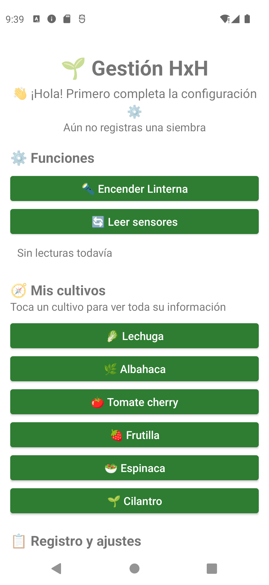
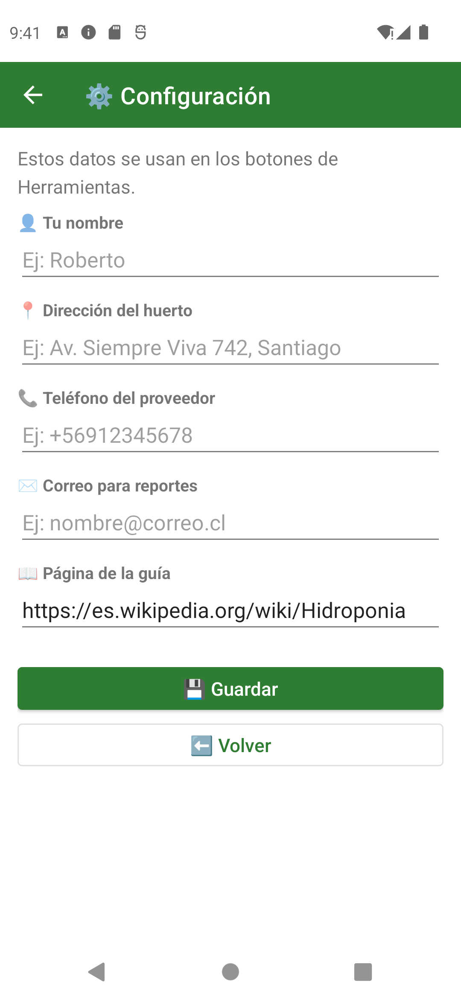
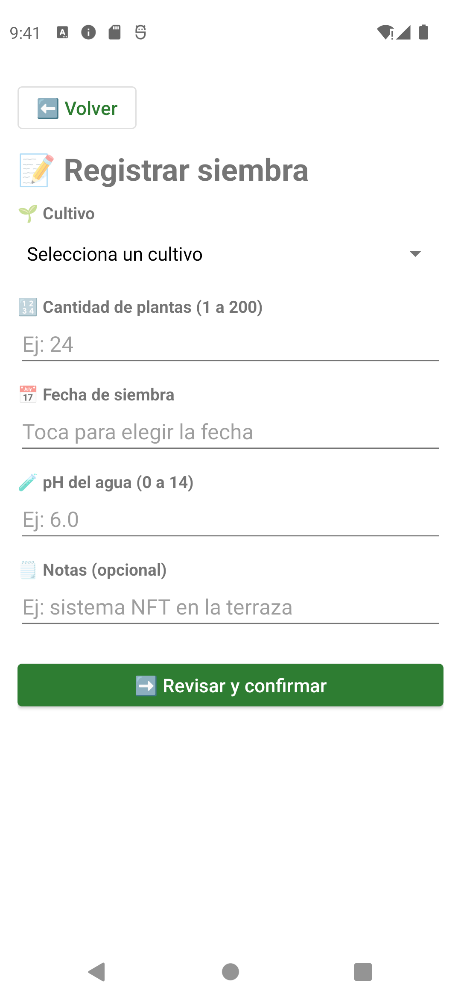
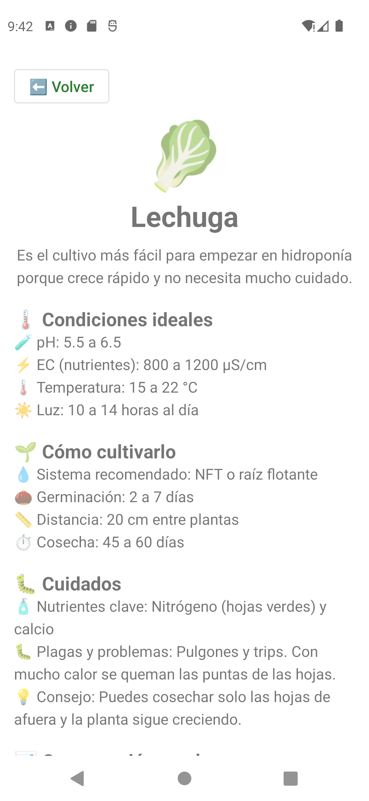
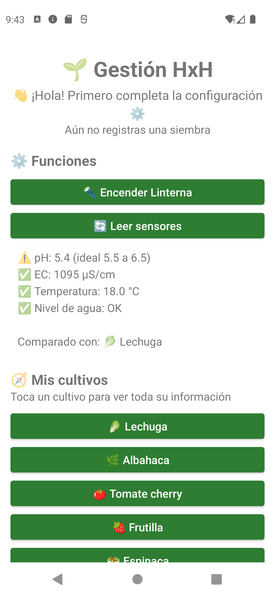
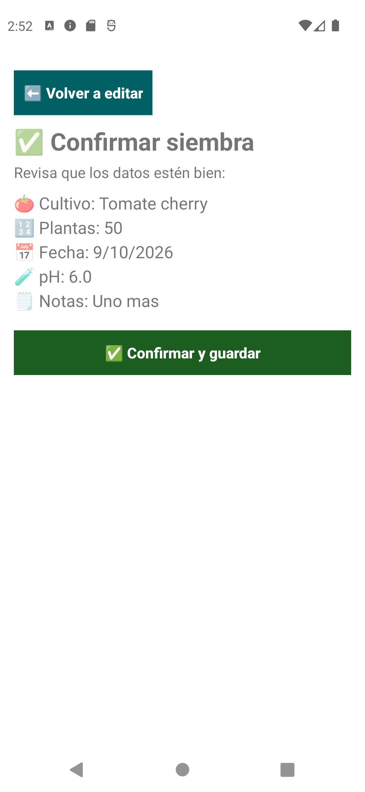
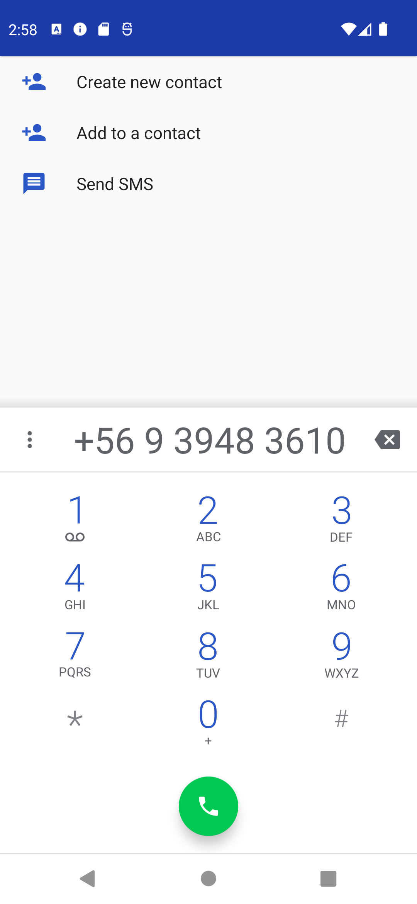
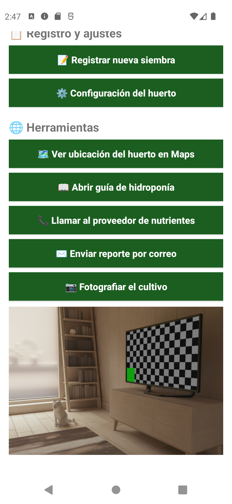

# 🌱 Gestión HxH

App de Android que hice para el **Prototipo 2** del ramo de Programación Android. La idea es tener en el celu todo lo que necesito para cuidar un **huerto hidropónico**: ver cómo se cultiva cada planta, revisar los sensores, anotar lo que voy sembrando y abrir otras apps (Maps, teléfono, correo, cámara) directo desde la app.

## 👥 Equipo

| Integrante | Qué hizo |
|---|---|
| Roberto Fuentes | Desarrollo de la app |


## 🛠️ Con qué la hice

| Cosa | Versión |
|---|---|
| Lenguaje | Java 11 |
| Android Gradle Plugin (AGP) | 9.0.1 |
| compileSdk | 36.1 |
| minSdk | 31 (Android 12) |
| IDE | Android Studio |

## 📱 Qué hace la app

- 🔦 Prende y apaga la **linterna**.
- 🔄 **Lee los sensores** (pH, nutrientes, temperatura y nivel de agua). Por ahora los valores son simulados y se leen en un **Thread** para que la app no se congele.
- 🥬 Muestra la info de **6 cultivos**: lechuga, albahaca, tomate cherry, frutilla, espinaca y cilantro.
- 📝 Permite **registrar una siembra** y confirmarla antes de guardarla.
- ⚙️ Tiene una pantalla de **configuración** para guardar mi nombre, la dirección del huerto, el teléfono del proveedor y un correo.
- ⬅️ Todas las pantallas tienen un botón para **volver**.

## 🗺️ Cómo se conectan las pantallas

```
MainActivity ──► DetalleActivity    (le paso los datos del cultivo con putExtra)
             ──► ConfigActivity     (ajustes, con Toolbar y flecha para volver)
             ──► FormActivity ──► ConfirmActivity  (espera la respuesta con registerForActivityResult)

MainActivity ──► Maps · Navegador · Teléfono · Correo · Cámara  (intents implícitos)
```

## 🌐 Intents implícitos (abren otras apps)

| # | Qué hace | Cómo lo hice | Cómo probarlo |
|---|---|---|---|
| 1 | 🗺️ Abre la ubicación del huerto en Google Maps | `ACTION_VIEW` con `geo:` | Guarda una dirección en Configuración y toca "Ver ubicación del huerto en Maps" |
| 2 | 🌍 Abre una página con info de hidroponía | `ACTION_VIEW` con `https://` | Toca "Abrir guía de hidroponía" |
| 3 | 📞 Abre el marcador con el número del proveedor | `ACTION_DIAL` con `tel:` (no pide permiso) | Guarda un teléfono en Configuración y toca "Llamar al proveedor" |
| 4 | ✉️ Abre el correo con el reporte ya escrito | `ACTION_SENDTO` con `mailto:` | Lee los sensores y toca "Enviar reporte por correo" |
| 5 | 📷 Saca una foto y la guarda en la galería | `MediaStore.ACTION_IMAGE_CAPTURE` | Toca "Fotografiar el cultivo" y acepta el permiso |

## 🧭 Intents explícitos (entre pantallas de la app)

| # | De → A | Qué hace | Cómo probarlo |
|---|---|---|---|
| 1 | `MainActivity` → `DetalleActivity` | Le paso toda la info del cultivo con `putExtra` | Toca cualquier cultivo |
| 2 | `MainActivity` → `ConfigActivity` | Pantalla de ajustes con Toolbar y flecha para volver | Toca "Configuración del huerto" |
| 3 | `FormActivity` → `ConfirmActivity` | El formulario espera la respuesta con `registerForActivityResult` | Toca "Registrar nueva siembra", llénalo y confirma |

## ✅ Validaciones que puse

- En el **formulario**: hay que elegir un cultivo, la cantidad va de 1 a 200, la fecha no puede ser futura y el pH tiene que estar entre 0 y 14.
- En la **configuración**: el nombre debe tener al menos 2 letras, el teléfono al menos 8 números, el correo debe ser válido y la página tiene que empezar con `https://`.
- Si falta un dato para usar Maps, el teléfono o el correo, la app avisa en vez de cerrarse.
- Si el celular no tiene una app para abrir algo, sale un mensaje (uso `try/catch` con `ActivityNotFoundException`).
- Antes de sacar la foto se pide el permiso de la cámara.

## 🧵 Dónde usé Threads

- Al **leer los sensores**: un hilo simula la lectura y va moviendo la barra de progreso con `runOnUiThread()`.
- Al **confirmar una siembra**: otro hilo simula que se guarda y después devuelve el código de la siembra.

## 📸 Capturas

| Inicio | Sensores | Detalle | Configuración |
|---|---|---|---|
|  |  |  |  |

| Formulario | Confirmación | Marcador | Cámara |
|---|---|---|---|
|  |  |  |  |

## 🧩 Código importante

**Un intent implícito con su validación** (en `MainActivity`):

```java
private void llamarProveedor() {
    SharedPreferences prefs = getSharedPreferences("huerto", MODE_PRIVATE);
    String telefono = prefs.getString("telefono", "");

    if (telefono.isEmpty()) {
        Toast.makeText(this, "📞 Primero ingresa el teléfono en Configuración", Toast.LENGTH_LONG).show();
        return;
    }

    Intent llamar = new Intent(Intent.ACTION_DIAL, Uri.parse("tel:" + telefono));
    try {
        startActivity(llamar);
    } catch (ActivityNotFoundException e) {
        Toast.makeText(this, "❌ No hay una app de teléfono", Toast.LENGTH_SHORT).show();
    }
}
```

**El intent explícito que espera respuesta** (en `FormActivity`):

```java
ActivityResultLauncher<Intent> confirmarLauncher = registerForActivityResult(
        new ActivityResultContracts.StartActivityForResult(),
        new ActivityResultCallback<ActivityResult>() {
            @Override
            public void onActivityResult(ActivityResult resultado) {
                if (resultado.getResultCode() == RESULT_OK && resultado.getData() != null) {
                    String codigo = resultado.getData().getStringExtra("codigo");
                    guardarSiembra(codigo);
                    finish();
                } else {
                    Toast.makeText(FormActivity.this, "✏️ Puedes corregir los datos", Toast.LENGTH_SHORT).show();
                }
            }
        });
```

**Cómo pido el permiso de la cámara** (en `MainActivity`):

```java
if (ContextCompat.checkSelfPermission(this, Manifest.permission.CAMERA)
        == PackageManager.PERMISSION_GRANTED) {
    abrirCamara();
} else {
    ActivityCompat.requestPermissions(this,
            new String[]{Manifest.permission.CAMERA}, PERMISO_CAMARA);
}
```

## ▶️ Cómo probarla

1. Clonar el repo y abrirlo en **Android Studio**.
2. Esperar que termine de sincronizar Gradle y darle ▶ **Run** (emulador o celular con Android 12 o más).
3. Para sacar el APK: **Build → Build APK(s)**. Queda en `app/build/outputs/apk/debug/app-debug.apk`.
4. 💡 Lo primero es llenar **Configuración**, porque Maps, la llamada y el correo usan esos datos.
5. 🔦 La linterna solo funciona en un celular de verdad; el emulador no tiene flash.

## 🌿 Ramas

- `main`: rama principal.
- `feature/intents`: donde fui trabajando este prototipo, de a poco y con commits chicos.

## 💭 Lo que aprendí

- `ACTION_DIAL` no necesita el permiso `CALL_PHONE`, porque la llamada la confirma uno mismo.
- Desde Android 11 hay que poner `<queries>` en el Manifest, si no, los intents implícitos no encuentran las apps.
- La pantalla solo se puede cambiar desde el hilo principal; por eso dentro del Thread uso `runOnUiThread()`.
- La linterna me tiraba error en el emulador porque no tiene flash. Lo arreglé con un `try/catch`.
- Dejé todos los textos en `strings.xml` y las medidas en `dimens.xml` para no escribirlos a mano en los layouts.
- **Para la próxima:** conectar sensores de verdad con un ESP32 por WiFi en vez de usar valores simulados.